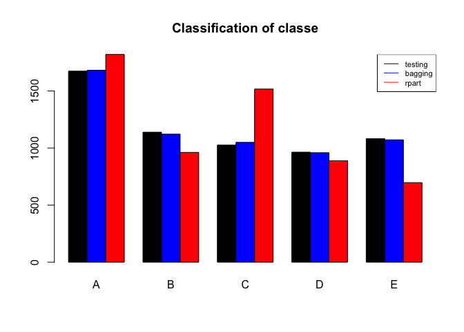

# Human Activity Recognition

## Executive Summary

The goal of this project is to use data from accelerometers on the belt, forearm, arm, and dumbell of 6 participants to build a model to predict how well a person does his/her exercise.

The training data for this project are available here:  
https://d396qusza40orc.cloudfront.net/predmachlearn/pml-training.csv

More information is available from the website here:  
http://groupware.les.inf.puc-rio.br/har (see the section on the Weight Lifting Exercise Dataset).

The prediction model built is also applied to the 20 different test cases from the website:  
https://d396qusza40orc.cloudfront.net/predmachlearn/pml-testing.csv


## Data Pre-processing


Read in the data.

```r
data <- read.csv("pml-training.csv")
testcases <- read.csv("pml-testing.csv")
dim(data)
```

```
## [1] 19622   160
```

Remove the non-predicting variables from the data.

```r
data <- subset(data, select=-c(X, user_name, raw_timestamp_part_1, raw_timestamp_part_2, cvtd_timestamp, new_window, num_window))
testcases <- subset(testcases, select=-c(X, user_name, raw_timestamp_part_1, raw_timestamp_part_2, cvtd_timestamp, new_window, num_window))
dim(data)
```

```
## [1] 19622   153
```

Remove variables with more than 10% NA values.

```r
na.count <- apply(data, 2, FUN=function(x){sum(is.na(x))})/nrow(data)
data <- data[, which(na.count<0.1)]
testcases <- testcases[, which(na.count<0.1)]
dim(data)
```

```
## [1] 19622    86
```

Remove all variables with near zero values.

```r
nzv <- nearZeroVar(data)
data <- data[, -nzv]
testcases <- testcases[, -nzv]
dim(data)
```

```
## [1] 19622    53
```

Convert all remaining variables to numeric.

```r
for (i in 1:52) data[,i] <- as.numeric(data[,i])
for (i in 1:52) testcases[,i] <- as.numeric(testcases[,i])
```

Remove all highly correlated variables.

```r
corr <- cor(data[,-53])
corr.var <- findCorrelation(corr, cutoff=0.8)

data <- data[, -corr.var]
testcases <- testcases[, -corr.var]
dim(data)
```

```
## [1] 19622    41
```

Split the data into training and testing set for cross validation.

```r
set.seed(333)
inTrain <- createDataPartition(y=data$classe, p=0.7, list=FALSE)
training <- data[inTrain,]
testing <- data[-inTrain,]
```


## Predicting with rpart

Fit a model using the 'rpart' function on the training data.

```r
set.seed(333)
fitRpart <- rpart(classe~., data=training)
print(fitRpart)
```

```
## n= 13737 
## 
## node), split, n, loss, yval, (yprob)
##       * denotes terminal node
## 
##    1) root 13737 9831 A (0.28 0.19 0.17 0.16 0.18)  
##      2) pitch_forearm< -33.15 1131   15 A (0.99 0.013 0 0 0) *
##      3) pitch_forearm>=-33.15 12606 9816 A (0.22 0.21 0.19 0.18 0.2)  
##        6) magnet_belt_y>=554.5 11591 8801 A (0.24 0.23 0.21 0.18 0.15)  
##         12) magnet_dumbbell_y< 426.5 9514 6807 A (0.28 0.18 0.24 0.17 0.12)  
##           24) roll_forearm< 123.5 6010 3578 A (0.4 0.18 0.18 0.14 0.091)  
##             48) magnet_dumbbell_z< -27.5 2060  708 A (0.66 0.21 0.014 0.072 0.052)  
##               96) roll_forearm>=-140.5 1746  421 A (0.76 0.17 0.014 0.026 0.031) *
##               97) roll_forearm< -140.5 314  186 B (0.086 0.41 0.013 0.32 0.17) *
##             49) magnet_dumbbell_z>=-27.5 3950 2870 A (0.27 0.16 0.27 0.18 0.11)  
##               98) yaw_belt>=169.5 469   56 A (0.88 0.049 0 0.07 0) *
##               99) yaw_belt< 169.5 3481 2424 C (0.19 0.18 0.3 0.2 0.13)  
##                198) accel_dumbbell_y>=-40.5 2974 2298 D (0.22 0.2 0.22 0.23 0.13)  
##                  396) yaw_arm< -117 200    3 A (0.98 0.015 0 0 0) *
##                  397) yaw_arm>=-117 2774 2098 D (0.17 0.22 0.23 0.24 0.14)  
##                    794) accel_forearm_x>=59.5 628  289 A (0.54 0.091 0.12 0.11 0.14) *
##                    795) accel_forearm_x< 59.5 2146 1537 D (0.06 0.25 0.26 0.28 0.14)  
##                     1590) magnet_dumbbell_y>=288.5 982  551 D (0.097 0.29 0.071 0.44 0.11)  
##                       3180) magnet_dumbbell_z>=76.5 325  127 B (0.08 0.61 0.031 0.21 0.071) *
##                       3181) magnet_dumbbell_z< 76.5 657  294 D (0.11 0.12 0.091 0.55 0.13) *
##                     1591) magnet_dumbbell_y< 288.5 1164  667 C (0.028 0.23 0.43 0.15 0.16) *
##                199) accel_dumbbell_y< -40.5 507   94 C (0.0059 0.043 0.81 0.028 0.11) *
##           25) roll_forearm>=123.5 3504 2284 C (0.078 0.17 0.35 0.22 0.18)  
##             50) accel_forearm_x>=-103.5 2466 1480 C (0.088 0.21 0.4 0.082 0.22)  
##              100) magnet_forearm_z< -262 201   34 A (0.83 0.17 0 0 0) *
##              101) magnet_forearm_z>=-262 2265 1279 C (0.023 0.21 0.44 0.089 0.24)  
##                202) magnet_dumbbell_y< 275.5 1332  539 C (0.03 0.16 0.6 0.054 0.16) *
##                203) magnet_dumbbell_y>=275.5 933  603 E (0.012 0.29 0.21 0.14 0.35)  
##                  406) roll_forearm< 132.5 144   36 C (0.0069 0.22 0.75 0 0.028) *
##                  407) roll_forearm>=132.5 789  463 E (0.013 0.3 0.11 0.16 0.41)  
##                    814) magnet_arm_x< 295.5 308  145 B (0.0065 0.53 0.17 0.16 0.14) *
##                    815) magnet_arm_x>=295.5 481  197 E (0.017 0.16 0.067 0.17 0.59) *
##             51) accel_forearm_x< -103.5 1038  478 D (0.055 0.093 0.23 0.54 0.087)  
##              102) magnet_arm_x< 236.5 340  149 C (0.026 0.16 0.56 0.21 0.047) *
##              103) magnet_arm_x>=236.5 698  209 D (0.069 0.063 0.062 0.7 0.11) *
##         13) magnet_dumbbell_y>=426.5 2077 1124 B (0.04 0.46 0.043 0.21 0.25)  
##           26) total_accel_dumbbell>=5.5 1476  606 B (0.056 0.59 0.059 0.03 0.26)  
##             52) magnet_belt_z< -292.5 1294  439 B (0.063 0.66 0.06 0.034 0.18) *
##             53) magnet_belt_z>=-292.5 182   28 E (0.011 0.082 0.055 0.0055 0.85) *
##           27) total_accel_dumbbell< 5.5 601  208 D (0 0.14 0.005 0.65 0.2)  
##             54) yaw_belt< 15.62 485   92 D (0 0.17 0.0062 0.81 0.012) *
##             55) yaw_belt>=15.62 116    0 E (0 0 0 0 1) *
##        7) magnet_belt_y< 554.5 1015  184 E (0 0.002 0 0.18 0.82)  
##         14) accel_forearm_z>=114.5 224   42 D (0 0.0089 0 0.81 0.18) *
##         15) accel_forearm_z< 114.5 791    0 E (0 0 0 0 1) *
```

Apply the model on the testing data to check the performance of the model.

```r
predRpart<- predict(fitRpart, newdata=testing, type='class')
os.error.rpart <- sum(predRpart != testing$classe)/nrow(testing) * 100
confusionMatrix(testing$classe, predRpart)$table
```

```
##           Reference
## Prediction    A    B    C    D    E
##          A 1506   63   42   58    5
##          B  156  573  279   89   42
##          C   43   58  864   42   19
##          D   57  117  155  595   40
##          E   58  151  177  105  591
```
This is a very bushy tree. The out-of-sample error is 29.8%, which is rather high. For the model to be usable, tree pruning is necessary to improve its performance.

##Predicting with bagging
Fit a model using the 'bagging' function on the training data.

```r
set.seed(333)
fitBag <- bagging(classe~., data=training)
print(fitBag)
```

```
## 
## Bagging classification trees with 25 bootstrap replications 
## 
## Call: bagging.data.frame(formula = classe ~ ., data = training)
```

Apply the model on the testing data to check the performance of the model.

```r
predBag <- predict(fitBag, newdata=testing, type='class')
os.error.bag <- sum(predBag != testing$classe)/nrow(testing) * 100
confusionMatrix(testing$classe, predBag)$table
```

```
##           Reference
## Prediction    A    B    C    D    E
##          A 1661    7    2    3    1
##          B   16 1097   15    6    5
##          C    0    9 1006   11    0
##          D    4    5   23  931    1
##          E    1    4    4    8 1065
```
The out-of-sample error is 2.12%, which is very low. This means that the model is able to predict the outcome very accurately.

## Conclusion

Comparing the out-of-sample errors from the two models, the model built using the 'bagging' function (2.12%) is a much more accurate model than the one built using 'rpart' (29.8%).


```r
res <- data.frame(id=row.names(testing), testing=testing$classe, bagging=predBag, rpart=predRpart)
res <- melt(res, id.vars="id", measure.vars=c("testing", "bagging", "rpart"))
res <- table(res$variable, res$value)
barplot(res, col=c('black', 'blue', 'red'), main="Classification of classe", beside=TRUE)
legend("topright", lty=c(1, 1, 1), col=c("black", "blue", "red"), legend=rownames(res), cex=0.7)
```



Hence, we shall apply the bagging model to the 20 test cases from the website.


```r
testcases$pred_classe <- predict(fitBag, newdata=testcases, type='class')
testcases[,c('problem_id', 'pred_classe')]
```

```
##    problem_id pred_classe
## 1           1           B
## 2           2           A
## 3           3           B
## 4           4           A
## 5           5           A
## 6           6           E
## 7           7           D
## 8           8           B
## 9           9           A
## 10         10           A
## 11         11           B
## 12         12           C
## 13         13           B
## 14         14           A
## 15         15           E
## 16         16           E
## 17         17           A
## 18         18           B
## 19         19           B
## 20         20           B
```


